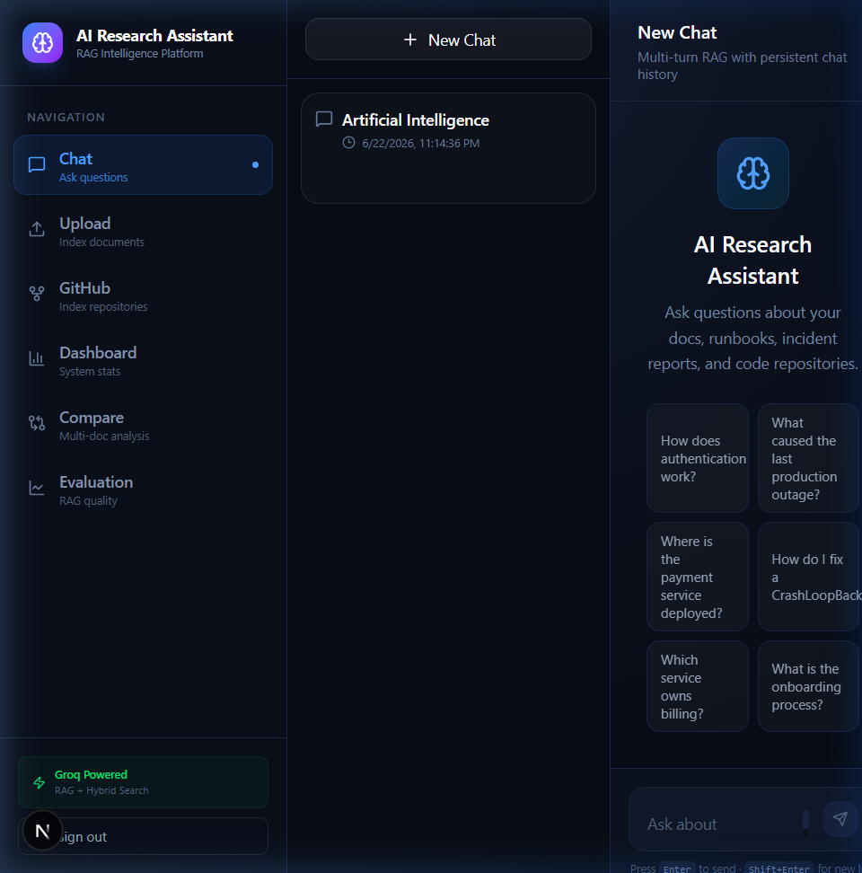
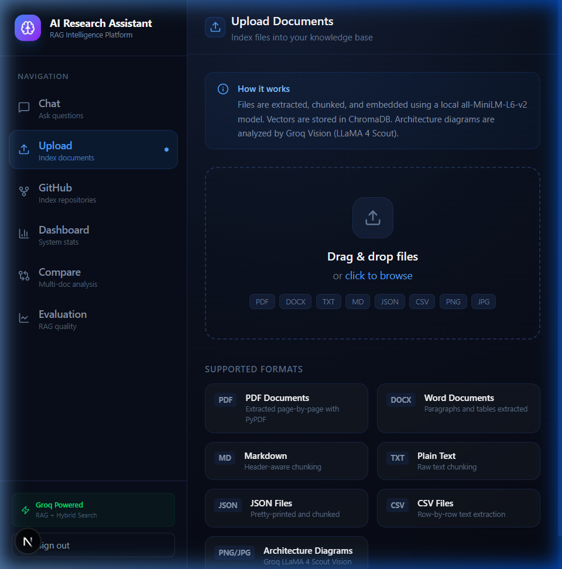
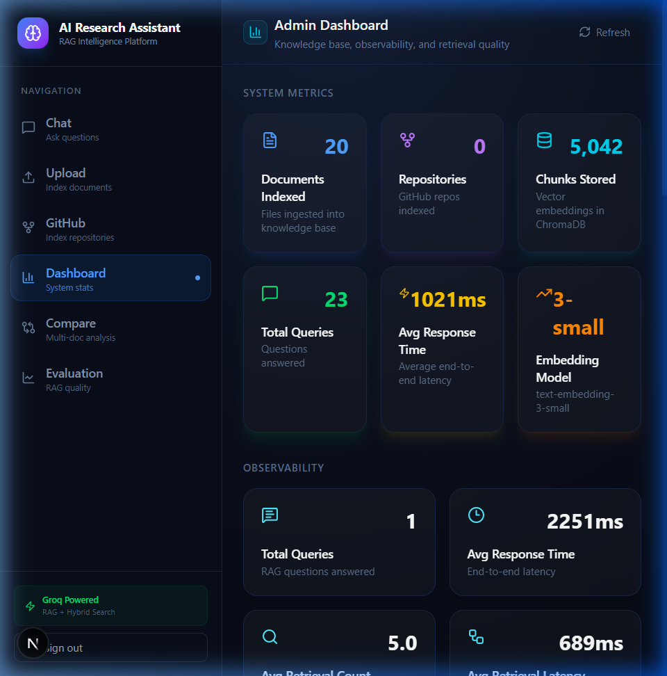

<div align="center">


# 🧠 AI Research Assistant

**An end-to-end Retrieval-Augmented Generation (RAG) platform.**  
Upload documents, index GitHub repos, ask questions with source citations,  
compare documents side-by-side, and track quality metrics — all in one place.

[**Live Demo**](#quick-start) · [**API Docs**](http://localhost:8000/docs) · [**Report Bug**](https://github.com/nidhidhameliya/AI-Research-Assistant/issues)

</div>

---

## 📸 Screenshots

<table>
  <tr>
    <td align="center"><b>Chat Interface</b></td>
    <td align="center"><b>Document Upload</b></td>
    <td align="center"><b>Admin Dashboard</b></td>
  </tr>
  <tr>
    <td></td>
    <td></td>
    <td></td>
  </tr>
</table>

---

## ✨ Features

### 🔍 Hybrid Retrieval Search
Combines **ChromaDB cosine vector search** + **BM25 keyword search**, fused via Reciprocal Rank Fusion (RRF) and re-ranked with **Maximal Marginal Relevance (MMR)** for diverse, high-quality results.

### 💬 Streaming Chat with Memory
Real-time token streaming via **Server-Sent Events (SSE)**. Every conversation is persisted to SQLite with full multi-turn memory — pick up where you left off across sessions.

### 📂 Multi-Format Document Ingestion
| Format | Extraction Method |
|--------|------------------|
| PDF | pypdf — page-by-page extraction |
| DOCX | python-docx — paragraphs + tables |
| Markdown / TXT | UTF-8 raw text |
| JSON | Pretty-printed structured text |
| CSV | Row-by-row comma-joined lines |
| PNG / JPG | **Groq LLaMA 4 Scout 17B Vision** — extracts components, flows, and annotations from architecture diagrams |

### 🐙 GitHub Repository Indexing
Shallow-clone any public (or private with token) GitHub repo, recursively index all source files (`.py`, `.ts`, `.go`, `.java`, `.md`, YAML, Terraform, SQL, and more), and make the entire codebase searchable in seconds.

### 🧠 Knowledge Cards
The LLM automatically extracts **2–4 structured knowledge cards** from every answer — categorised as `concept`, `service`, `flow`, or `alert` — surfacing key insights at a glance.

### 📊 Multi-Document Compare
Select any two indexed sources and ask a question. The backend retrieves the top chunks from each document, sends them to Groq, and returns a side-by-side structured comparison with an AI-generated summary.

### 📈 Observability & Evaluation
- Per-query latency, retrieval count, LLM latency, and token usage tracked in SQLite
- Top documents and top questions leaderboard
- RAG quality evaluation endpoint (`/evaluation`)

### 🔐 JWT Authentication
Full register/login/logout flow with `PyJWT`. On `localhost`, a demo session is auto-bootstrapped so you can explore without signing up.

---

## 🏗️ Architecture

```
┌──────────────────────────────────────────────────────────────────┐
│                        Next.js Frontend                          │
│  Chat · Upload · GitHub · Compare · Evaluation · Dashboard       │
└───────────────────┬──────────────────────────────────────────────┘
                    │  /api/* (rewrites) + dedicated upload route
                    ▼
┌──────────────────────────────────────────────────────────────────┐
│                       FastAPI Backend                            │
│                                                                  │
│  POST /upload ──► extract_text() ──► chunk_text()               │
│  POST /github-index ──► git clone ──► collect files             │
│                              │                                   │
│                              ▼                                   │
│                    embed_texts()                                 │
│                 (all-MiniLM-L6-v2, local)                        │
│                              │                                   │
│                              ▼                                   │
│                   ChromaDB PersistentClient                      │
│                   (cosine similarity, HNSW)                      │
│                                                                  │
│  POST /chat ──► embed_query()                                    │
│            ──► vector_search (top-K)                             │
│            ──► BM25 keyword search (full corpus)                 │
│            ──► Reciprocal Rank Fusion                            │
│            ──► MMR diversity re-ranking                          │
│            ──► build_prompt() + Groq LLaMA 3.3 70B SSE stream   │
│            ──► parse_knowledge_cards()                           │
│            ──► record_metric() ──► SQLite                        │
└──────────────────────────────────────────────────────────────────┘
```

---

## 🛠️ Tech Stack

| Layer | Technology |
|-------|-----------|
| **Frontend** | Next.js 16.2 · React 19 · TypeScript · Tailwind CSS v4 |
| **UI Components** | Radix UI · Lucide Icons · react-markdown |
| **Backend** | FastAPI 0.115 · Python 3.12 · Uvicorn |
| **LLM — Chat** | Groq · LLaMA 3.3 70B Versatile |
| **LLM — Vision** | Groq · LLaMA 4 Scout 17B (architecture diagram analysis) |
| **Embeddings** | all-MiniLM-L6-v2 (local, via ChromaDB `DefaultEmbeddingFunction`) |
| **Vector Store** | ChromaDB (persistent, HNSW cosine index) |
| **Keyword Search** | BM25 Okapi (`rank-bm25`) |
| **Database** | SQLite (chats, auth, per-query metrics, aggregate stats) |
| **Auth** | PyJWT · bcrypt |
| **Git Indexing** | GitPython (shallow clone) |
| **Document Parsing** | pypdf · python-docx |
| **Logging** | structlog (structured JSON logs) |
| **Containerization** | Docker · docker-compose |

---

## 🚀 Quick Start

### Prerequisites

- **Python 3.12+**
- **Node.js 20+**
- **Groq API key** — free at [console.groq.com](https://console.groq.com)

### 1. Clone the repository

```bash
git clone https://github.com/nidhidhameliya/AI-Research-Assistant.git
cd AI-Research-Assistant
```

### 2. Configure environment

```bash
cp .env.example .env
```

Edit `.env`:

```env
# Required
GROQ_API_KEY=gsk_your_key_here

# Optional (these are the defaults)
GROQ_CHAT_MODEL=llama-3.3-70b-versatile
GROQ_VISION_MODEL=meta-llama/llama-4-scout-17b-16e-instruct
JWT_SECRET_KEY=change-me-in-production
LOG_LEVEL=INFO
```

> **Windows only** — also update the system-level env var to avoid stale overrides:
> ```powershell
> [System.Environment]::SetEnvironmentVariable("GROQ_API_KEY", "gsk_...", "User")
> ```

### 3. Start the project

**Option A — One command (Windows PowerShell)**
```powershell
powershell -ExecutionPolicy Bypass -File scripts/start-all.ps1
```

**Option B — Manual**

```bash
# Terminal 1 — Backend
cd backend
python -m venv .venv
.venv\Scripts\activate          # Windows
# source .venv/bin/activate     # macOS/Linux
pip install -r requirements.txt
uvicorn main:app --host 0.0.0.0 --port 8000 --reload

# Terminal 2 — Frontend
cd frontend
npm install
npm run dev
```

**Option C — Docker**
```bash
docker-compose up --build
```

### 4. Open the app

| Service | URL |
|---------|-----|
| 🖥️ Frontend | http://localhost:3000 |
| ⚙️ Backend API | http://localhost:8000 |
| 📖 API Docs (Swagger) | http://localhost:8000/docs |
| ❤️ Health Check | http://localhost:8000/health |

> On `localhost`, the app **automatically creates a demo session** — no login required.

---

## 📁 Project Structure

```
AI-Research-Assistant/
│
├── backend/                          # FastAPI application
│   ├── main.py                       # App entry point, CORS, lifespan
│   ├── config.py                     # Pydantic settings (reads .env)
│   ├── security.py                   # JWT middleware & current_user dep
│   ├── requirements.txt
│   ├── Dockerfile
│   │
│   ├── db/
│   │   ├── chroma.py                 # ChromaDB PersistentClient + collection
│   │   ├── sqlite.py                 # SQLite schema initialisation
│   │   ├── auth_store.py             # Register / login / user lookup
│   │   ├── chat_store.py             # Chat threads & message persistence
│   │   ├── metrics_store.py          # Per-query metric rows
│   │   └── stats_store.py            # Aggregate JSON counters
│   │
│   ├── routers/
│   │   ├── auth.py                   # POST /auth/register|login|logout, GET /auth/me
│   │   ├── chat.py                   # POST /chat, /chat/new; GET /chats, /chat/{id}
│   │   ├── upload.py                 # POST /upload (multipart)
│   │   ├── github.py                 # POST /github-index
│   │   ├── compare.py                # POST /compare
│   │   ├── sources.py                # GET /sources, DELETE /sources/{name}
│   │   ├── stats.py                  # GET /stats
│   │   ├── metrics.py                # GET /metrics
│   │   └── evaluation.py             # GET /evaluation
│   │
│   └── services/
│       ├── llm.py                    # Groq streaming, knowledge card extraction
│       ├── retrieval.py              # Hybrid search: vector + BM25 + RRF + MMR
│       ├── embedding.py              # Local all-MiniLM-L6-v2 embeddings
│       ├── ingestion.py              # Text extraction (PDF, DOCX, images, …)
│       └── chunking.py               # Recursive text chunking with overlap
│
├── frontend/                         # Next.js 16 application
│   ├── app/
│   │   ├── layout.tsx                # Root layout (Inter font, sidebar, dark bg)
│   │   ├── globals.css               # Design tokens, utility classes
│   │   ├── page.tsx                  # Root → redirect to /chat
│   │   ├── api/upload/route.ts       # Dedicated upload API route (110s timeout)
│   │   ├── chat/page.tsx             # Streaming chat interface
│   │   ├── upload/page.tsx           # Drag-and-drop file uploader
│   │   ├── github/page.tsx           # GitHub repository indexer
│   │   ├── admin/page.tsx            # System stats dashboard
│   │   ├── compare/page.tsx          # Multi-document comparison
│   │   ├── evaluation/page.tsx       # RAG quality metrics
│   │   └── auth/                     # Login & register pages
│   │
│   ├── components/
│   │   ├── layout/Sidebar.tsx        # Navigation sidebar
│   │   ├── chat/                     # MessageList, ChatInput, KnowledgeCards, SourcePanel
│   │   ├── upload/FileDropzone.tsx   # Drag-drop with per-file progress
│   │   ├── admin/                    # SourcesTable, StatsCards
│   │   └── auth/RequireAuth.tsx      # SSR-safe auth gate + demo session bootstrap
│   │
│   ├── hooks/
│   │   └── useChat.ts                # SSE streaming state machine
│   │
│   ├── lib/
│   │   ├── api.ts                    # Typed API client (all endpoints)
│   │   ├── streaming.ts              # SSE reader + event dispatcher
│   │   └── auth.ts                   # localStorage token helpers
│   │
│   └── next.config.ts                # Rewrites, 50MB body limit, keepAlive off
│
├── scripts/
│   ├── start-all.ps1                 # Launches both services (Windows)
│   ├── start-backend.ps1
│   └── start-frontend.ps1
│
├── sample-data/                      # Example documents for quick testing
│   ├── architecture-overview.md
│   ├── auth-service.md
│   ├── incident_2025_05_14.md
│   └── kubernetes-runbook.md
│
├── uploads/                          # Uploaded files (gitignored)
├── vectorstore/                      # ChromaDB + SQLite data (gitignored)
├── docker-compose.yml
├── .env.example
└── README.md
```

---

## 📡 API Reference

### Authentication

| Method | Endpoint | Auth | Description |
|--------|----------|------|-------------|
| `POST` | `/auth/register` | ❌ | Create account → returns JWT + user |
| `POST` | `/auth/login` | ❌ | Sign in → returns JWT + user |
| `POST` | `/auth/logout` | ✅ | Invalidate session (client-side) |
| `GET` | `/auth/me` | ✅ | Return current user profile |

### Chat

| Method | Endpoint | Auth | Description |
|--------|----------|------|-------------|
| `POST` | `/chat/new` | ✅ | Create a new chat thread |
| `GET` | `/chats` | ✅ | List all chats (most recent first) |
| `GET` | `/chat/{id}` | ✅ | Fetch full message history |
| `DELETE` | `/chat/{id}` | ✅ | Permanently delete a chat |
| `POST` | `/chat` | ✅ | Ask a RAG question — SSE stream or JSON |

**Chat request body:**
```json
{
  "question": "How does authentication work?",
  "stream": true,
  "chat_id": "optional-existing-chat-id",
  "filter_doc_type": "optional-type-filter"
}
```

**SSE event types:**
```
data: {"type": "chat",    "chat_id": "abc123"}
data: {"type": "sources", "sources": [...]}
data: {"type": "token",   "content": "The auth..."}
data: {"type": "done",    "knowledge_cards": [...], "response_time_ms": 1420}
data: [DONE]
```

### Ingestion

| Method | Endpoint | Auth | Description |
|--------|----------|------|-------------|
| `POST` | `/upload` | ✅ | Upload & index a document (multipart/form-data) |
| `POST` | `/github-index` | ✅ | Index a GitHub repository by URL |

### Knowledge Base

| Method | Endpoint | Auth | Description |
|--------|----------|------|-------------|
| `GET` | `/sources` | ✅ | List all indexed sources with metadata |
| `DELETE` | `/sources/{filename}` | ✅ | Remove a source from the index |

### Analytics

| Method | Endpoint | Auth | Description |
|--------|----------|------|-------------|
| `GET` | `/stats` | ✅ | Documents indexed, chunks, queries, avg latency |
| `GET` | `/metrics` | ✅ | Per-query metrics, top docs, top questions |
| `GET` | `/evaluation` | ✅ | RAG quality summary |
| `POST` | `/compare` | ✅ | Side-by-side multi-document comparison |
| `GET` | `/health` | ❌ | Backend + ChromaDB status |

---

## 💡 Usage Examples

### Upload a document

```bash
curl -X POST http://localhost:8000/upload \
  -H "Authorization: Bearer <token>" \
  -F "file=@my-runbook.pdf"
```
```json
{
  "filename": "my-runbook.pdf",
  "chunks_created": 42,
  "doc_type": "runbook",
  "message": "Successfully indexed 42 chunks from my-runbook.pdf"
}
```

### Ask a question (streaming)

```bash
curl -N -X POST http://localhost:8000/chat \
  -H "Content-Type: application/json" \
  -H "Authorization: Bearer <token>" \
  -d '{"question": "How do I roll back a deployment?", "stream": true}'
```

### Non-streaming chat

```bash
curl -X POST http://localhost:8000/chat \
  -H "Content-Type: application/json" \
  -H "Authorization: Bearer <token>" \
  -d '{"question": "What is the on-call escalation path?", "stream": false}'
```

### Index a GitHub repository

```bash
curl -X POST http://localhost:8000/github-index \
  -H "Content-Type: application/json" \
  -H "Authorization: Bearer <token>" \
  -d '{"repo_url": "https://github.com/org/repo", "branch": "main"}'
```
```json
{
  "repo_url": "https://github.com/org/repo",
  "files_indexed": 87,
  "chunks_created": 1204,
  "message": "Successfully indexed 87 files (1204 chunks) from org/repo"
}
```

### Compare two documents

```bash
curl -X POST http://localhost:8000/compare \
  -H "Content-Type: application/json" \
  -H "Authorization: Bearer <token>" \
  -d '{
    "documents": ["aws-runbook.pdf", "gcp-runbook.pdf"],
    "question": "Compare their failover procedures"
  }'
```

### Register and get a token

```bash
curl -X POST http://localhost:8000/auth/register \
  -H "Content-Type: application/json" \
  -d '{"email": "you@example.com", "password": "password123"}'
```

---

## ⚙️ Environment Variables

| Variable | Required | Default | Description |
|----------|:--------:|---------|-------------|
| `GROQ_API_KEY` | ✅ | — | Groq API key from [console.groq.com](https://console.groq.com) |
| `GROQ_CHAT_MODEL` | | `llama-3.3-70b-versatile` | LLM for chat and comparison |
| `GROQ_VISION_MODEL` | | `meta-llama/llama-4-scout-17b-16e-instruct` | Vision model for image files |
| `JWT_SECRET_KEY` | ✅ prod | `change-me-in-production` | Secret for signing JWTs |
| `CHROMA_HOST` | | `localhost` | ChromaDB host (`chromadb` in Docker) |
| `CHROMA_PORT` | | `8000` | ChromaDB port |
| `UPLOAD_DIR` | | `./uploads` | Uploaded files directory |
| `APP_DB_PATH` | | `./vectorstore/app.db` | SQLite path for chats, auth, metrics |
| `GITHUB_TOKEN` | | — | GitHub PAT for private repository access |
| `LOG_LEVEL` | | `INFO` | `DEBUG` · `INFO` · `WARNING` · `ERROR` |
| `NEXT_PUBLIC_API_URL` | | `http://localhost:8000` | Backend URL used by the frontend |
| `NEXT_PUBLIC_APP_NAME` | | `AI Research Assistant` | App name displayed in the UI |

---

## 🐳 Docker Deployment

```bash
# Start the full stack
docker-compose up --build

# Run in background
docker-compose up -d --build

# Stop everything
docker-compose down
```

**Services exposed:**

| Container | Host Port | Description |
|-----------|-----------|-------------|
| `engineer_hub_frontend` | 3000 | Next.js app |
| `engineer_hub_backend` | 8000 | FastAPI + Uvicorn |
| `engineer_hub_chroma` | 8001 | ChromaDB vector store |

> In Docker, the backend connects to ChromaDB via the internal hostname `chromadb:8000`.
> Set `CHROMA_HOST=chromadb` in your `.env` when using compose.

---

## 🌐 Production Deployment

For production, the project is configured to run as a decoupled application:
* **Frontend:** Hosted on **Vercel** (Production & Preview domains).
* **Backend & Databases:** Hosted on **Railway** (Persistent Docker container).

### 1. Backend (Railway)
The backend runs in a Docker container using the root `backend/Dockerfile`.
* **Database Persistence:** Mount a persistent volume at `/app/vectorstore` (1GB is sufficient) to persist your SQLite database (`app.db`) and ChromaDB vector store between restarts.
* **Environment Variables:**
  - `GROQ_API_KEY`: Your Groq API Key.
  - `UPLOAD_DIR`: `/app/uploads`
  - `APP_DB_PATH`: `/app/vectorstore/app.db`
  - `CHROMA_PERSIST_DIR`: `/app/vectorstore`
  - `LOG_LEVEL`: `INFO`
  - `JWT_SECRET_KEY`: A secure random string.
* **Auto-Recovery:** The backend contains built-in recovery for corrupted ONNX embedding models. If the `all-MiniLM-L6-v2` model download gets corrupted in the cache, the backend automatically purges the `.cache/chroma` directory and pulls a fresh copy, avoiding upload crashes.

### 2. Frontend (Vercel)
The frontend is deployed to Vercel and configured to connect directly to the Railway backend.
* **Environment Variables:**
  - Set `NEXT_PUBLIC_API_URL` (in Vercel's Environment Variables dashboard) to your Railway backend URL (e.g., `https://your-backend.up.railway.app`).
* **Direct Client-to-Backend Architecture:**
  Next.js client-side requests (file uploads, SSE streams, chats) are sent **directly** to the `NEXT_PUBLIC_API_URL` instead of being proxied through Vercel serverless rewrites. This bypasses Vercel's strict **10-second serverless execution timeout**, allowing large document ingestions (which take 20-60 seconds) to complete successfully without throwing `502 Bad Gateway` errors.

---

## 🔧 Troubleshooting

<details>
<summary><b>❌ Error: 401 Invalid API Key from Groq</b></summary>

A stale Windows User Environment Variable is overriding your `.env` file. Pydantic-settings always prefers OS-level env vars.

```powershell
# Check the current system-level value
[System.Environment]::GetEnvironmentVariable("GROQ_API_KEY", "User")

# Fix it
[System.Environment]::SetEnvironmentVariable("GROQ_API_KEY", "gsk_your_correct_key", "User")
```

Then **restart your terminal** and re-run the backend.
</details>

<details>
<summary><b>❌ Upload fails / Internal Server Error</b></summary>

Large PDFs can take 20–60 seconds to embed locally (CPU-bound MiniLM model).
The frontend uses a dedicated `/api/upload` Next.js route with a 110-second timeout specifically to handle this.

Make sure you are running the **latest frontend** (`npm run dev`). If errors persist, upload directly to the backend:
```bash
curl -X POST http://localhost:8000/upload -F "file=@your-file.pdf"
```
</details>

<details>
<summary><b>❌ Backend returns {"detail": "Not Found"}</b></summary>

The root path `/` has no route. Use `/health`, `/docs` (Swagger UI), or any API endpoint listed above.
</details>

<details>
<summary><b>❌ Frontend hydration error in console</b></summary>

This was a known issue with `RequireAuth` reading `localStorage` during SSR. It is fixed in the current version using a `mounted` flag pattern. Run `npm run dev` to get the latest build.
</details>

<details>
<summary><b>❌ ChromaDB connection failed on startup</b></summary>

In local development, the backend warns about ChromaDB on the first startup if the `vectorstore/` directory is empty. This is **safe to ignore** — it uses a `PersistentClient` and will initialise the collection on the first request.

For Docker, ensure the `chromadb` container passes its health check before the backend starts.
</details>

<details>
<summary><b>❌ JWT errors after server restart</b></summary>

`JWT_SECRET_KEY` must be the same value across restarts. If it changes, all existing tokens become invalid. Set it explicitly in `.env` and never use the default in production.
</details>

---

## 🗺️ Roadmap

- [ ] Streaming support for document comparison
- [ ] Multi-user workspace isolation
- [ ] Slack / Teams integration for Q&A
- [ ] Re-index / update existing sources
- [ ] Export chat history as PDF/Markdown
- [ ] OpenTelemetry tracing integration
- [ ] Support for additional LLM providers (OpenAI, Anthropic)

---

## 🤝 Contributing

Pull requests are welcome. For major changes, please open an issue first to discuss what you would like to change.

1. Fork the repository
2. Create your feature branch (`git checkout -b feature/amazing-feature`)
3. Commit your changes (`git commit -m 'feat: add amazing feature'`)
4. Push to the branch (`git push origin feature/amazing-feature`)
5. Open a Pull Request

---

## 📄 License

This project is licensed under the **MIT License**.

---

<div align="center">

Built with ❤️ using [Groq](https://groq.com) · [FastAPI](https://fastapi.tiangolo.com) · [Next.js](https://nextjs.org) · [ChromaDB](https://www.trychroma.com)

</div>